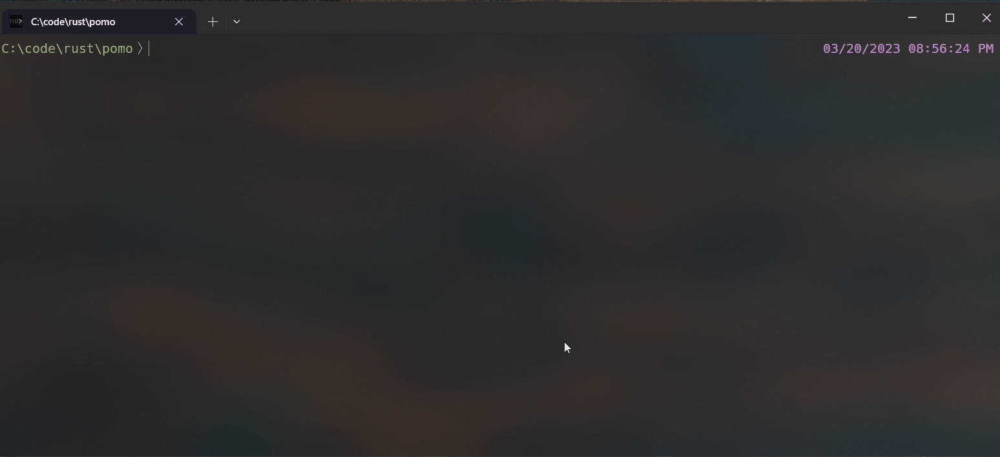

# Pomotime

A zero dependency(except for the Rust standard library) Pomodoro timer for terminals. 



## Installing
From Cargo
`cargo install pomotime`

From Source
```
git clone https://github.com/charliemonnone/pomo
cd pomo
cargo build --release
```
Then move the binary in `target/release/pomo` to a suitable location and add it to your path.

